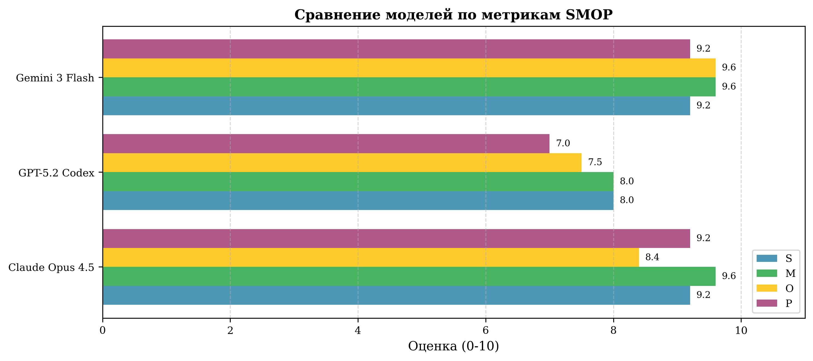
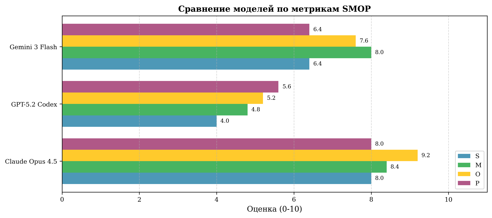
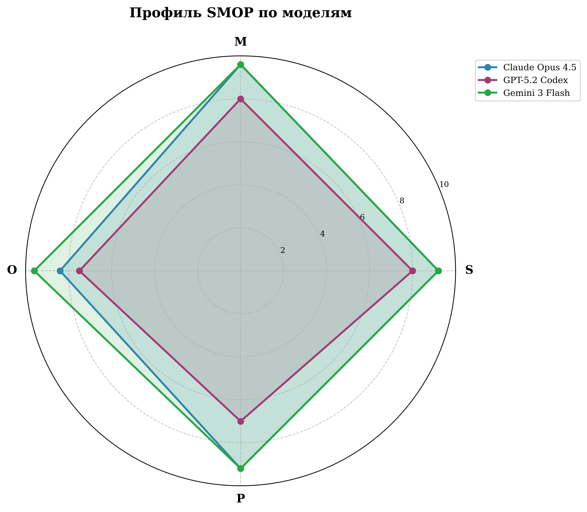
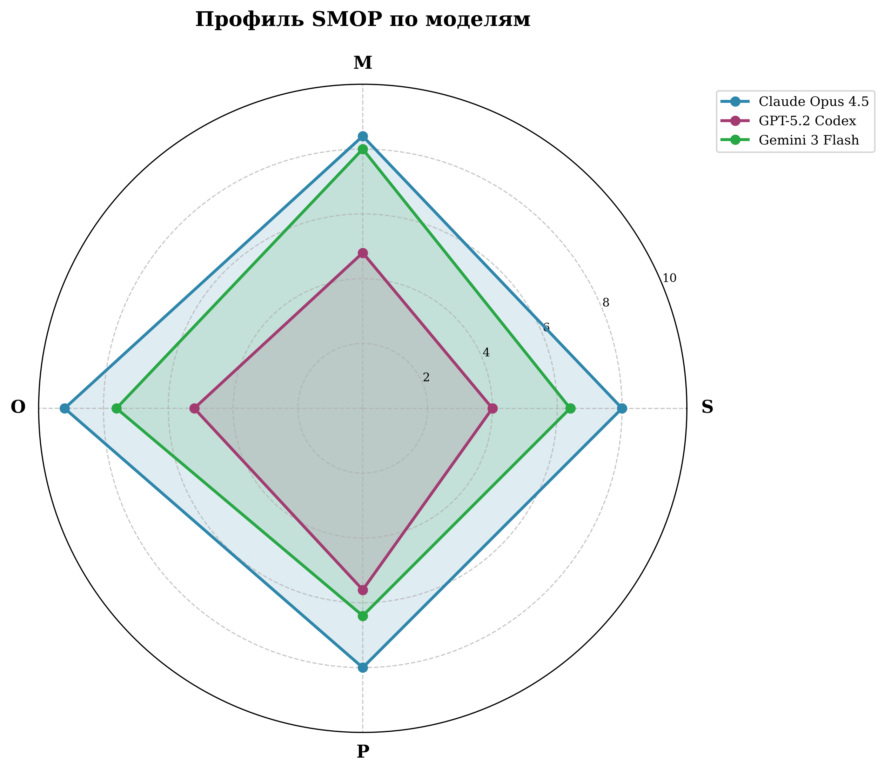
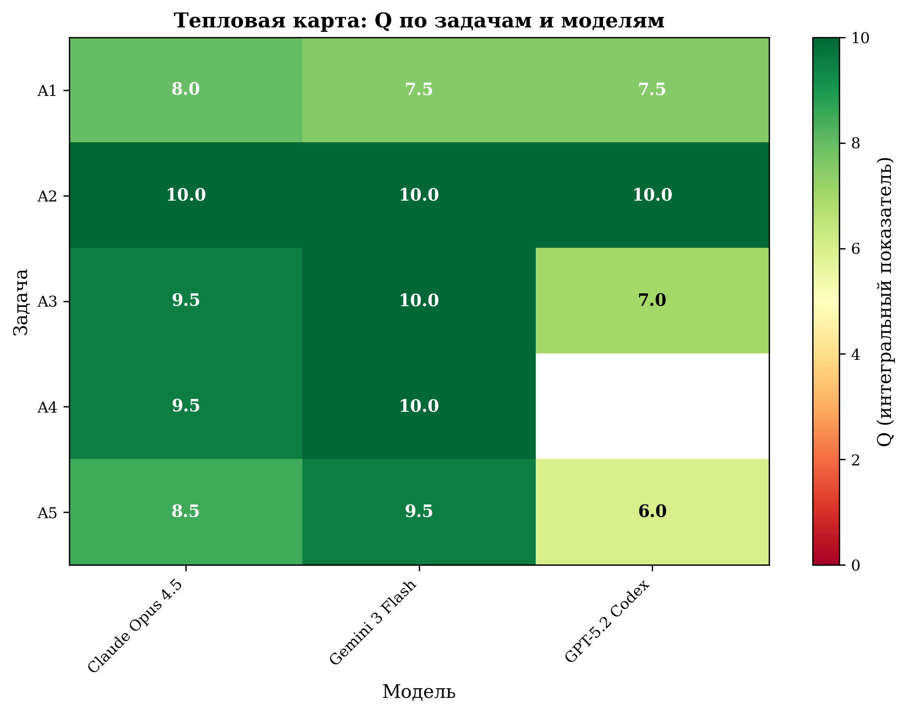
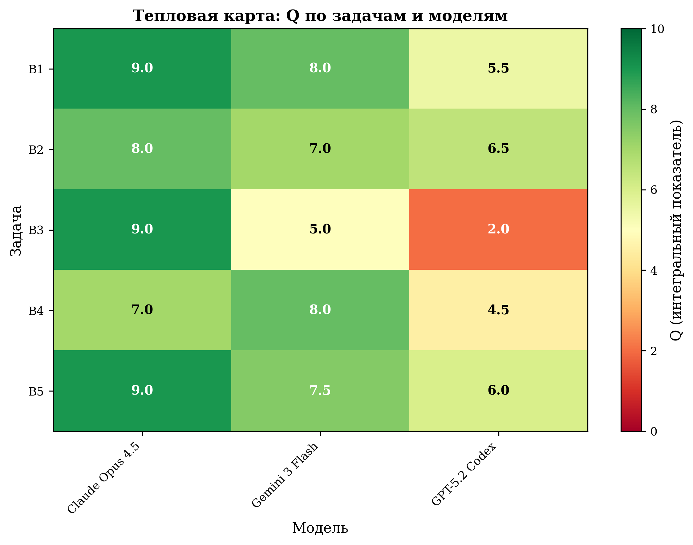

# Экспериментальная оценка эффективности искусственного интеллекта в генерации кода для доменно-специфичных платформ (на примере 1С:Предприятие 8)

[]()
[]()
[](LICENSE.md)
[](https://github.com/4dand/1c-ai-codegen-research-paper)

> **Всероссийский конкурс достижений талантливой молодёжи «Национальное достояние России», 2026**
>
> **Автор:** Андреев Данила Сергеевич  
> **Научный руководитель:** Гальцкова Юлия Михайловна  
> **Место выполнения:** ГАПОУ ПО «Пензенский Колледж Информационных и Промышленных Технологий (ИТ-Колледж)»

---

> **Предупреждение**:
> Репозиторий находится в активном наполнении. Ряд артефактов ещё не загружен.
> Все опубликованные числовые результаты и отчёты соответствуют финальной версии работы.

---

## О работе

Исследование посвящено **сравнительной оценке больших языковых моделей (LLM) при автоматической генерации кода на языке BSL** — встроенном языке платформы 1С:Предприятие 8.

Центральная проблема: существующие бенчмарки (HumanEval, MBPP и др.) не подходят для оценки кода на доменно-специфичных языках, тесно связанных с метаданными конфигурации. Для решения этой задачи разработана методика **SMOP** и программный комплекс **[GenLab-1C](https://github.com/4dand/genlab-1c-core)** ([веб-платформа](https://github.com/4dand/genlab-1c-web)).

Эксперимент охватывает два сценария:
- **Категория А** — общеалгоритмические задачи, не требующие знания метаданных платформы;
- **Категория Б** — платформенно-ориентированные задачи в конфигурации «Управление торговлей 11» (УТ11), где модели получают контекст метаданных через **Model Context Protocol (MCP)**.

Полный текст работы: [andreev-ai-codegen-1c-2026.pdf](andreev-ai-codegen-1c-2026.pdf)

---

## Ключевые результаты

### Сравнение моделей

| Модель | Категория А (Q) | Категория Б (Q) | Δ |
|--------|:---:|:---:|:---:|
| Claude Opus 4.5 | 9.1 | **8.4** | −0.7 |
| Gemini 3 Flash | **9.4** | 7.1 | −2.3 |
| GPT-5.2 Codex | 7.6 | 4.9 | −2.7 |
| **Среднее** | **8.8** | **6.8** | **−2.0** |

<p align="center">
  
  
</p>
<p align="center">
  <em>Сравнение Q по моделям — Слева: Категория А (алгоритмические задачи) &nbsp;|&nbsp; Справа: Категория Б (платформенные задачи, УТ11)</em>
</p>

<p align="center">
  
  
</p>
<p align="center">
  <em>Радарная диаграмма SMOP — Слева: Категория А &nbsp;|&nbsp; Справа: Категория Б</em>
</p>

<p align="center">
  
  
</p>
<p align="center">
  <em>Тепловая карта Q по задачам и моделям — Слева: Категория А &nbsp;|&nbsp; Справа: Категория Б</em>
</p>

### Детальные метрики SMOP — Категория Б

| Модель | S | M | O | P | Q | σ_Q |
|--------|:---:|:---:|:---:|:---:|:---:|:---:|
| Claude Opus 4.5 | 8.0 | 8.4 | **9.2** | 8.0 | **8.4** | 0.89 |
| Gemini 3 Flash | 6.4 | 8.0 | 7.6 | 6.4 | 7.1 | 1.20 |
| GPT-5.2 Codex | 4.0 | 4.8 | 5.2 | 5.6 | 4.9 | 1.71 |

### Изменение метрик при переходе от А к Б (Δ = Б − А)

| Модель | ΔS | ΔM | ΔO | ΔP | ΔQ |
|--------|:---:|:---:|:---:|:---:|:---:|
| Claude Opus 4.5 | −1.2 | −1.2 | **+0.8** | −1.2 | −0.70 |
| Gemini 3 Flash | −2.8 | −1.6 | −2.0 | −2.8 | −2.30 |
| GPT-5.2 Codex | −4.0 | −3.2 | −2.3 | −1.4 | −2.73 |

> Claude Opus 4.5 — единственная модель с положительным ΔO (+0.8): получив доступ к метаданным через MCP, она строит более оптимальные запросы. Падение Q при переходе A→Б отражает принципиально большую сложность платформенных задач, а не деградацию от MCP — для корректной оценки вклада MCP необходимо было бы сравнивать Б с гипотетической Б' (те же задачи, без контекста).

### Выводы

- **Категория А (алгоритмы):** все три модели справляются уверенно — средний Q = 8.8/10, медиана = 9.5.
- **Категория Б (платформенные задачи):** качество падает в среднем на −2.0 пункта (средний Q = 6.8), разброс от 2.0 до 9.0.
- **Claude Opus 4.5** — наиболее стабильная модель: лидер в категории Б (Q = 8.4, σ = 0.89) при наименьшем разбросе результатов; рекомендуется для платформенной разработки 1С с MCP.
- **Gemini 3 Flash** — лучший результат в категории А (Q = 9.4), но заметное падение на платформенных задачах из-за синтаксических ошибок (ΔS = −2.8) и неточностей в метаданных (ΔP = −2.8).
- **GPT-5.2 Codex** — критическое снижение в категории Б (Q = 4.9, σ = 1.71); задача B3 выполнена с обрезанным выводом (Q = 2.0); непригодна для платформенных задач в текущем состоянии.
- Передача контекста метаданных через MCP **не устраняет** разрыв в качестве полностью: платформенная интеграция по-прежнему остаётся слабым местом всех моделей.

### Ограничения исследования

| # | Ограничение |
|---|-------------|
| 1 | **Размер выборки** — 5 задач на категорию (10 всего); достаточно для первичных выводов, но не для статистических обобщений |
| 2 | **Одна конфигурация** — все задачи Б выполнялись в контексте УТ11; результаты могут не переноситься на БП, ERP, ЗУП и др. |
| 3 | **Нет контрольной группы Б без MCP** — невозможно изолированно измерить вклад самого протокола MCP |
| 4 | **Ограниченный контекст MCP** — загружалось не более 2–3 объектов метаданных на задачу; реальные сценарии могут требовать 5–10 |
| 5 | **Ручная экспертная оценка** — автоматическая тестовая среда (Vanessa Automation, 1С:Тестировщик) не использовалась |
| 6 | **Фиксированные параметры** — temperature = 0, без сохранения контекста беседы; результаты при других параметрах могут отличаться |
| 7 | **Состав моделей актуален на март 2026** — новые версии или fine-tune под 1С могут изменить наблюдаемые соотношения |

---

## Методика SMOP

SMOP — авторская система оценки качества сгенерированного кода, разработанная специально для доменно-специфичных языков, тесно связанных с метаданными конфигурации. Четыре критерия выбраны исходя из специфики платформы 1С:Предприятие: базовая исполнимость кода (S), корректность решения задачи (M), соответствие стандартам платформы (O) и точность работы с объектами метаданных (P).

| Критерий | Название | Что оценивается |
|----------|----------|-----------------|
| **S** | Syntax | Компилируемость кода в среде 1С:Предприятие |
| **M** | Meaning | Соответствие логики кода требованиям задания |
| **O** | Optimization | Оптимальность и соответствие стандартам разработки 1С |
| **P** | Platform | Корректность использования объектов метаданных конфигурации |

Каждый критерий оценивается по **дискретной шкале: 0 / 2 / 4 / 6 / 8 / 10**. Чётная шкала без «средней» оценки намеренно вынуждает эксперта принимать однозначное решение.

### S — Синтаксическая корректность

| Балл | Критерий |
|:----:|----------|
| 10 | Код компилируется без ошибок и предупреждений |
| 8 | Код компилируется, присутствуют 1–2 незначительных предупреждения |
| 6 | Код компилируется после исправления 1–2 очевидных опечаток |
| 4 | Требуется исправление 3–5 синтаксических ошибок |
| 2 | Требуется исправление более 5 ошибок, однако общая структура кода понятна |
| 0 | Код не компилируется, требуется существенная переработка |

### M — Семантическая корректность

| Балл | Критерий |
|:----:|----------|
| 10 | Код полностью выполняет поставленную задачу, все требования реализованы |
| 8 | Основная логика реализована верно, не выполнено одно второстепенное требование |
| 6 | Основная логика верна, не реализованы 2–3 требования или не обработаны краевые случаи |
| 4 | Реализована только часть требуемой логики (более 50%) |
| 2 | Реализовано менее 50% требуемой логики |
| 0 | Код не выполняет поставленную задачу |

### O — Оптимальность

| Балл | Критерий |
|:----:|----------|
| 10 | Код соответствует стандартам разработки 1С, оптимален по производительности |
| 8 | Незначительные отклонения от стандартов, не влияющие на производительность |
| 6 | Код работоспособен, но имеются явные возможности оптимизации |
| 4 | Присутствуют неэффективные решения: запросы в цикле, избыточные обращения к БД |
| 2 | Множественные антипаттерны, код будет работать неприемлемо медленно |
| 0 | Критические проблемы производительности или архитектуры решения |

### P — Платформенная интеграция

| Балл | Критерий |
|:----:|----------|
| 10 | Все объекты метаданных и методы платформы использованы корректно |
| 8 | Присутствуют 1–2 неточности в именах реквизитов или методов, легко исправимые |
| 6 | Допущены ошибки в работе с типами данных или структурой объектов конфигурации |
| 4 | Использованы несуществующие реквизиты, регистры или методы (до 30% обращений) |
| 2 | Более 30% обращений к несуществующим объектам метаданных или методам платформы |
| 0 | Код построен на полностью вымышленной структуре конфигурации |

### Интегральный показатель Q

$$Q = \frac{S + M + O + P}{4}$$

Равные веса всех четырёх критериев приняты как консервативное допущение при отсутствии эмпирических данных об их относительной значимости.

| Уровень | Q | Интерпретация |
|---------|:---:|---------------|
| 🟢 Высокий | ≥ 8.0 | Код пригоден к использованию с минимальными доработками |
| 🟡 Приемлемый | 5.0 – 7.9 | Требуется доработка |
| 🔴 Низкий | < 5.0 | Требуется существенная переработка |

Шкала валидировалась в пилотной сессии с тремя экспертами-разработчиками 1С (опыт от 2 лет). Машиночитаемое описание критериев — в [configs/smop_criteria.yaml](configs/smop_criteria.yaml).

---

## Исследуемые модели

| Модель | ID (OpenRouter) | Контекст | Цена вх. / исх. ($/1M) | Воспроизводимость |
|--------|----------------|:---:|:---:|:---:|
| Claude Opus 4.5 | `anthropic/claude-opus-4.5` | 200K | 5.00 / 25.00 | temperature=0 |
| GPT-5.2 Codex | `openai/gpt-5.2-codex` | 400K | 1.75 / 14.00 | seed=178 |
| Gemini 3 Flash | `google/gemini-3-flash-preview` | 1M | 0.50 / 3.00 | seed=178 |

Все модели запускались через единый API-шлюз **OpenRouter**. Полные параметры генерации — в [configs/models.yaml](configs/models.yaml).

---

## Тестовые задания

### Категория А — алгоритмические (без контекста метаданных)

| ID | Задание | Сложность |
|----|---------|:---------:|
| A1 | Сортировка массива пузырьком | низкая |
| A2 | Парсинг строки ФИО | низкая |
| A3 | Подсчёт рабочих дней между двумя датами | низкая |
| A4 | Парсинг JSON-строки | средняя |
| A5 | Группировка таблицы значений | высокая |

### Категория Б — платформенные задачи (УТ11, контекст через MCP)

| ID | Задание | Сложность |
|----|---------|:---------:|
| B1 | Получение остатков товаров на складе | средняя |
| B2 | Заполнение цен в табличной части | высокая |
| B3 | Списание товаров по FIFO | высокая |
| B4 | Расчёт себестоимости продажи | средняя |
| B5 | Пересчёт валютных сумм | высокая |

Промпты всех заданий — в [configs/tasks_category_A.yaml](configs/tasks_category_A.yaml) и [configs/tasks_category_B.yaml](configs/tasks_category_B.yaml).

---

## Структура репозитория

```
andreev-ai-codegen-1c-2026.pdf      # Полный текст научной работы
CITATION.cff                         # Метаданные для цитирования
LICENSE.md                           # CC BY 4.0
│
├── configs/
│   ├── experiment.yaml              # Метаданные эксперимента
│   ├── models.yaml                  # Параметры исследуемых LLM
│   ├── settings.yaml                # Настройки окружения (API, пути, логи)
│   ├── smop_criteria.yaml           # Критерии и шкала оценки SMOP
│   ├── tasks_category_A.yaml        # Тестовые задания категории А (A1–A5)
│   └── tasks_category_B.yaml        # Тестовые задания категории Б (B1–B5)
│
├── code_outputs/
│   ├── experiment_A_20260301_125458/  # Сгенерированный код, категория А
│   │   └── <задача>/<модель>/run_1.bsl + summary.txt
│   └── experiment_B_20260301_130327/  # Сгенерированный код, категория Б
│       └── <задача>/<модель>/run_1.bsl + summary.txt
│
├── evaluations/
│   ├── experiment_A_..._expert_01_evaluation.json  # SMOP-оценки, категория А
│   └── experiment_B_..._expert_01_evaluation.json  # SMOP-оценки, категория Б
│
├── raw_results/
│   ├── experiment_A_20260301_125458.json  # Сырые ответы моделей с метаданными
│   └── experiment_B_20260301_130327.json
│
└── reports/
    ├── *_report.html        # Интерактивные HTML-отчёты
    ├── *_report.json        # Машиночитаемые отчёты
    ├── *_tables.tex         # LaTeX-таблицы для статьи
    └── charts/              # Графики (PNG / SVG / PDF): boxplot, heatmap,
                             # radar, dashboard, models_comparison, distribution
```

---

## Экосистема GenLab-1C

Данный репозиторий — архив данных научной работы. Программный комплекс, на котором проводился эксперимент, опубликован раздельно:

| Репозиторий | Описание |
|-------------|----------|
| 📄 **[1c-ai-codegen-research-paper](https://github.com/4dand/1c-ai-codegen-research-paper)** ← вы здесь | Научная работа, конфиги, данные, отчёты |
| ⚙️ **[genlab-1c-core](https://github.com/4dand/genlab-1c-core)** | Open Source научное ядро: генерация через LLM, экспертная оценка SMOP, статистика и отчёты |
| 🌐 **[genlab-1c-web](https://github.com/4dand/genlab-1c-web)** | Веб-платформа: управление экспериментами, коллаборативная оценка, дашборды |

---

## English Summary

**Benchmarking LLM Code Generation for 1C:Enterprise 8 (BSL Language)**

This repository is the reproducible research artifact for a study comparing three large language models on code generation tasks for the 1C:Enterprise platform. The paper proposes the **SMOP** evaluation framework (**S**yntax, **M**eaning, **O**ptimization, **P**latform) and the **GenLab-1C** toolchain for running structured benchmarks on domain-specific languages.

**Models evaluated:** Claude Opus 4.5 · GPT-5.2 Codex · Gemini 3 Flash (via OpenRouter)

**Key findings:**
- Category A (algorithmic tasks, no metadata context): mean Q = **8.8**/10 — all models perform well
- Category B (platform-specific tasks with MCP metadata context): mean Q = **6.8**/10 — significant quality drop across all models
- Claude Opus 4.5 is the most consistent model (Q = 8.4 in Category B); GPT-5.2 Codex shows critical degradation (Q = 4.9)
- Providing metadata context via MCP improves platform criterion scores but does not close the quality gap entirely

---

## Как цитировать

```bibtex
@misc{andreev2026llm1c,
  author    = {Андреев, Данила Сергеевич},
  title     = {Экспериментальная оценка эффективности искусственного интеллекта в генерации кода для доменно-специфичных платформ (на примере 1С:Предприятие 8)},
  year      = {2026},
  url       = {https://github.com/4dand/1c-ai-codegen-research-paper},
  note      = {Всероссийский конкурс «Национальное достояние России», 2026}
}
```

Также доступно машиночитаемое описание: [CITATION.cff](CITATION.cff)

---

## Лицензия

Текст работы и материалы исследования распространяются под лицензией
[Creative Commons Attribution 4.0 International (CC BY 4.0)](LICENSE.md).
